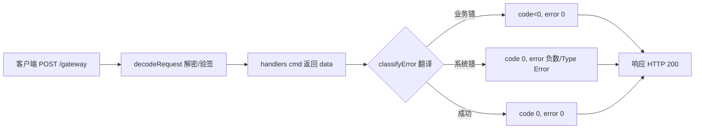

## 用户需求

- 改造 Cocos 后端响应层，使前端能依据回包 `code<0` 判失败、`code===0` 判成功，打通前后端联调；当前服务器把业务错误回成正数 `code`（默认 1 / 400 / 401 / 500），导致前端无法区分成功与失败。
- 采用**分阶段**策略：阶段一先做"错误码负数化"最小映射（保证能联调），阶段二再做完整数组信封重构。
- 范围限定为**代码改动清单**（文件、改动点、验收标准），不编写测试用例。

## 产品概述

- 仅改造服务器唯一入口 `POST /gateway` 的响应出包层，将 `BusinessError` 语义翻译为前端可识别的负数码与系统错 `error` 字段；业务、数据、鉴权、第三方登录等逻辑层完全不动。

## 核心功能

- 阶段一（错误码负数化）：在 `dispatch.ts` 出包点集中做错误分类翻译——业务错映射为 `code<0`、`error===0`；系统/参数/鉴权错映射为 `code===0` 且 `error` 取对应负数或 `'Type Error'`；成功为 `code===0, error===0`。HTTP 状态恒为 200。
- 阶段二（数组信封重构）：将响应从过渡对象重构为文档约定的定长数组 `[code, action, data, error, sign]`，`sign` 用 `REQUEST_SECRET` 对数组做 MD5 签名。

## 技术栈

- 沿用现有栈：Node.js + Express + TypeScript（CommonJS / ES2020），运行时零新增依赖。
- 加解密/签名复用 `src/utils/crypto.ts` 现有逻辑，不引入新库。

## 实现方案

### 总体策略

- 阶段一：仅在 `src/protocol/dispatch.ts` 成功（line 46）与 `catch`（lines 47-52）两处出包点新增 `classifyError(e)` 翻译函数，把 `BusinessError` 的正数码集中转换为前端语义码。这是改动面最小的"单点映射"，service/handler/repo/50 个 throw 站点零改动，风险可控。
- 阶段二：抽离 `src/utils/gateway.ts` 作为统一响应构造器（构造数组信封 + 签名），`dispatch.ts` 调用它出包，彻底移除旧 `{ErrorCode, Payload, Msg}` 形态。

### 关键技术决策与权衡

- **集中映射而非逐站点改码**：错误码值分散在 50 处 `throw`，逐站改负数侵入大且易遗漏；在 `dispatch.ts` 出口一次性翻译，符合"单一职责/最小改动"，且未来切换真实码值表只需改一处。
- **HTTP 恒 200 不变**：延续框架铁律（错误只进 `code`/`error`，否则前端当网络故障重试），阶段一/二均保持。
- **签名密钥沿用 `REQUEST_SECRET`（默认 `9572`）**：与前端 `getRequestSecret()` 一致，阶段二 `sign` 用同一密钥，避免联调不对称。
- **加密请求路径(o/s信封)不受影响**：仅响应侧变化，请求解码逻辑 `decodeRequest` 不动。

### 性能与可靠性

- 映射为纯内存分支判断（O(1)），无 I/O、无额外序列化开销；`classifyError` 仅做数值/字符串映射，不影响吞吐。
- 错误响应不携带敏感载荷（仅 msg 文本），避免泄露内部结构。

## 实现注意事项

- **向后兼容**：阶段一过渡期不破坏现有 handler 返回结构（仍返回纯 `data`），仅改变最外层出包形态；阶段二才移除旧字段。
- **号段约定**：业务错统一取 `-Math.abs(c)`（如默认 1 → -1），系统错固定语义码（401→-10015、4001→-1000004、4004→'Type Error'、500→1、4000/400→-1000001），具体数值以与前端最终对齐的码表为准。
- **不触碰红线**：不改 50 个 `throw`、不改 `errors.ts` 类定义、不引入异步副作用；日志沿用现有错误文本，不打印密钥。
- **待前端确认**：阶段一过渡回包形状（补 `code/error` 键的对象 vs 直接数组）、阶段二 `action` 字段是否必填及数组顺序，定稿前需与前端对齐。

## 架构设计

### 数据流（改造后）

请求 → `decodeRequest` → `handlers[cmd]`(返回纯 data) → `classifyError`/网关构造器 → 响应(`code`/`error` 或数组信封，HTTP 200)



### 组件关系

- `dispatch.ts`：唯一出包编排点，调用映射/构造器。
- `gateway.ts`（阶段二新增）：响应信封构造 + 签名，无业务依赖。
- `errors.ts` / service / handler / repo：保持原状，不感知信封。

## 目录结构

```
src/
├── protocol/
│   └── dispatch.ts          # [MODIFY] 阶段一：新增 classifyError，改写 line46 成功与 47-52 catch 出包，业务错→负数 code、系统错→error。阶段二：改调用 gateway 构造器，移除 {ErrorCode,Payload,Msg}。
├── utils/
│   └── gateway.ts           # [NEW] 阶段二：实现 buildResponse({code,action,data,error}) → 定长数组 [code,action,data,error,sign]，sign 用 REQUEST_SECRET 对数组 MD5（复用 crypto.ts）。
├── utils/
│   └── errors.ts           # [MODIFY-可选] 阶段二：补充错误码常量表（如 SYS_UNAUTH=-10015, SYS_TAMPER=-1000004），供 classifyError 引用，提升可维护性。
└── protocol/
    └── cmd.ts              # [MODIFY-可选] 阶段二：补充 cmd→action 语义映射，供网关填充 action 字段。
```

明确**不改动**：`src/utils/errors.ts` 类结构（阶段一）、50 处 `throw` 站点、`src/services/*`、`src/protocol/handlers/*`、`src/repositories/*`、`src/models/*`、`src/middleware/*`、`src/utils/crypto.ts` 的请求解码逻辑。

## 关键代码结构

```typescript
// 阶段一：dispatch.ts 内新增的错误分类翻译（示意签名）
type OutEnvelope = { code: number; error: number | string; msg?: string };
function classifyError(e: unknown): OutEnvelope { /* 见上文号段约定 */ }

// 阶段二：gateway.ts 数组信封构造器（示意签名）
type GatewayResponse = [code: number, action: string, data: unknown, error: number | string, sign: string];
function buildResponse(input: { code: number; action: string; data: unknown; error: number | string }): GatewayResponse { /* sign = md5(serialize([...]), REQUEST_SECRET) */ }
```